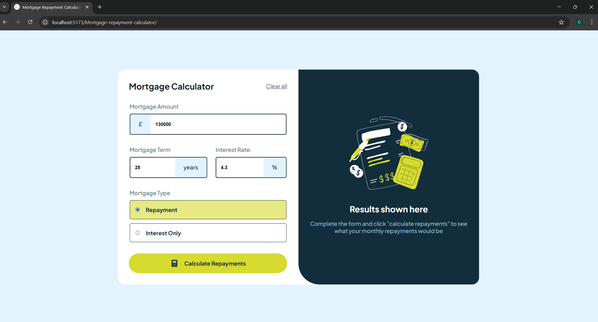

# Frontend Mentor - Mortgage repayment calculator solution

This is a solution to the [Mortgage repayment calculator challenge on Frontend Mentor](https://www.frontendmentor.io/challenges/mortgage-repayment-calculator-Galx1LXK73). Frontend Mentor challenges help you improve your coding skills by building realistic projects.

## Overview

### The challenge

Users should be able to:

- Input mortgage information and see monthly repayment and total repayment amounts after submitting the form
- See form validation messages if any field is incomplete
- View the optimal layout for the interface depending on their device's screen size
- See hover and focus states for all interactive elements on the page

### Screenshot

### Links

- Live Site URL: [https://clem-coding.github.io/Mortgage-repayment-calculator/](https://clem-coding.github.io/Mortgage-repayment-calculator/)

### Built with

- Semantic HTML5 markup
- CSS custom properties
- Flexbox
- Relative units
- Mobile-first workflow
- [React](https://reactjs.org/) – JavaScript library
- [Vite](https://vitejs.dev/) – Build tool and dev server
